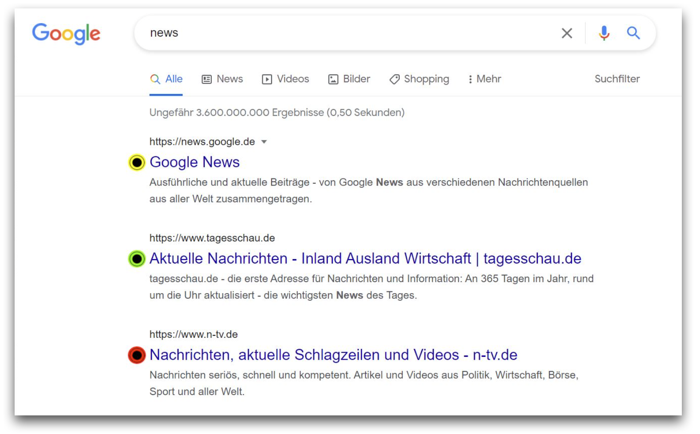

# CODE: Privacy Labels for your Google Search results
Extension for the Chrome browser which allows users to "see behind the links" on the Google Search results page.
You're welcome to check out our [technical report](Technical_Report.md) for detailed information about the project.

## Installation
Extension can be installed from the [Chrome Web Store](https://chrome.google.com/webstore/detail/cookie-decliner/pfgokjomcikflphieccllalibiejlcde?hl=de&authuser=0).

## Project structure
The directory structure is as follows:
### "develop" branch
* [Database_communication/](https://github.com/DonSimerino/CODE-DaWeSys/tree/develop/Database_communication) for backend code and databases
* [extension/](https://github.com/DonSimerino/CODE-DaWeSys/tree/develop/extension) for extension files
* [img/](https://github.com/DonSimerino/CODE-DaWeSys/tree/develop/img) images and files for this readme and the technical report
### "gcloud" branch
* backend running on the [Google Cloud Server](https://code-dawesys.appspot.com)

## Development setup
Clone this repository:
```git clone https://github.com/DonSimerino/CODE-DaWeSys.git```

You can either run the code locally or on the cloud server. Comment out the not needed lines in `content.js`:
```javascript
251 //xhttp.open("POST", "https://code-dawesys.appspot.com/sendurls/", true); //Google Cloud
252 xhttp.open("POST", "http://127.0.0.1:5000/sendurls/", true); //local
```
```javascript
587 //xhttp.open("POST", "https://code-dawesys.appspot.com/sendurls/", true); //Google Cloud
588 xhttp.open("POST", "http://127.0.0.1:5000/sendurls/", true); //local
```
If you decide to run the project locally, run the `main.py`file.

## App `main.py` (TO DO)
...

## Label calculation `interpret_whotracksme.py` (TO DO)
...

## Databases (TO DO)
You'll find several databases under [`Database_comminication/safeBrowsing/`](https://github.com/DonSimerino/CODE-DaWeSys/tree/develop/Database_communication/safeBrowsing):
* `datenbank.db`: ...
* `labels.db`: ...
* `newlabels.db`: ...
* `phishstats.db`: ...
* `top500webpages.db`: ...
* `whotracksme.db`: ...

## Install extension
You can add the extension manually to your Chrome browser:
1. Open Chrome browser, navigate to `chrome://extensions/` and enable `Developer mode`
2. Go to `Load unpacked` and select the `extension` directory
3. You a ready to go: Google something and check out the labels 🟢🟡🔴

## The MIT License (MIT)
Copyright © 2021

Permission is hereby granted, free of charge, to any person obtaining a copy of this software and associated documentation files (the “Software”), to deal in the Software without restriction, including without limitation the rights to use, copy, modify, merge, publish, distribute, sublicense, and/or sell copies of the Software, and to permit persons to whom the Software is furnished to do so, subject to the following conditions:

The above copyright notice and this permission notice shall be included in all copies or substantial portions of the Software.

THE SOFTWARE IS PROVIDED “AS IS”, WITHOUT WARRANTY OF ANY KIND, EXPRESS OR IMPLIED, INCLUDING BUT NOT LIMITED TO THE WARRANTIES OF MERCHANTABILITY, FITNESS FOR A PARTICULAR PURPOSE AND NONINFRINGEMENT. IN NO EVENT SHALL THE AUTHORS OR COPYRIGHT HOLDERS BE LIABLE FOR ANY CLAIM, DAMAGES OR OTHER LIABILITY, WHETHER IN AN ACTION OF CONTRACT, TORT OR OTHERWISE, ARISING FROM, OUT OF OR IN CONNECTION WITH THE SOFTWARE OR THE USE OR OTHER DEALINGS IN THE SOFTWARE.

## Dependencies
This software depends on the following third party software products:

* [bootstrap](https://github.com/twbs/bootstrap.git) under MIT License
* [webflow css](github.com/necolas/normalize.css) under MIT License
* [flask](https://github.com/pallets/flask.git) under BSD-3-Clause License


